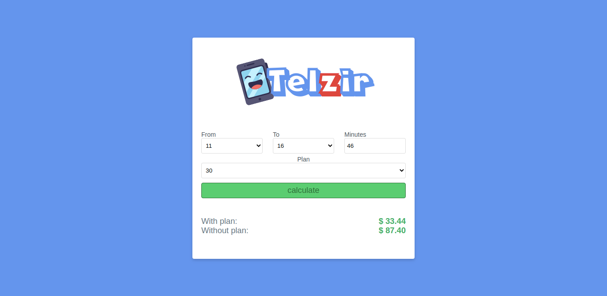

<p align="center">
  
<p>

<p align="center">
  <a href="https://app.netlify.com/sites/luiz-telzir/deploys">
    
  </a>
  <a href="https://circleci.com/gh/luizclr/telzir">
    
  </a>
</p>

## Table of Contents

- [Application](#application)
- [Requirements](#requirements)
- [Running](#running)
  - [Install](#install)
  - [Yarn](#yarn)
  - [Docker](#docker)
- [Testing](#testing)
- [Build](#build)
- [License](#license)

## Application

<p align="center">
  
</p>

> A _Telzir_ application that helps customers to choose the best phone plan acording to their calling time.

<h2 align="center"><a href="https://luiz-telzir.netlify.app/">https://luiz-telzir.netlify.app/</a><h2>

## Requirements

- nodejs >= 12.18.1
- yarn >= 1.22.4

## Running

### Install

```bash
# Install packages
yarn install
```

### Yarn

```bash
# Start dev server locally
yarn start
```

### Docker

```bash
# Build
docker build -t telzir:dev .
# Run
docker run -v ${PWD}:/app -v /app/node_modules -p 3001:3000 --rm telzir:dev
```

Application will be opened automatically on [localhost:3000](http://localhost:3000).

## Testing

```bash
# run teste
yarn test
# test coverage
yarn test:coverage
```

## Build

```bash
# Build for production
yarn build
```

## License

This project is licensed under the MIT License - see the [LICENSE](LICENSE) file for details.
